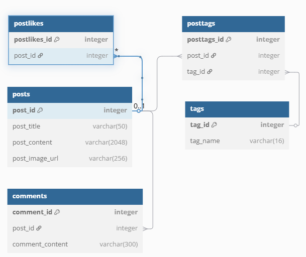

# Блог-платформа на Spring Framework

## Описание проекта

Это веб-приложение блога, разработанное с использованием Spring Framework 6.1+ и Java 21. Приложение предоставляет функционал для создания и управления постами, комментариями и лайками.

## Основной функционал

- Лента постов с превью (название, картинка, краткое содержание)
- Фильтрация по тегам и пагинация
- Страница поста с полным содержанием, комментариями и лайками
- CRUD операции для постов и комментариев

## Технологии

### Основной стек
- **Java 21**
- **Spring Framework 6.2.1**
    - Spring MVC
    - Spring Data JDBC
    - Spring Test
- **Сервер**: Tomcat 10+
- **База данных**: H2 (in-memory)
- **Шаблонизатор**: Thymeleaf 3.1.2
- **Система сборки**: Maven

### Тестирование
- JUnit 5
- Mockito
- Spring TestContext Framework

### Схема базы данных


## Запуск проекта

### Требования
- JDK 21
- Maven 3.9+
- Сервлет-контейнер Tomcat 10+

### Сборка и запуск
Клонировать репозиторий:
```
git clone https://github.com/yourusername/spring-blog-app.git
```

Собрать проект:
```
mvn clean package
```

Развернуть WAR-файл в сервлет-контейнере